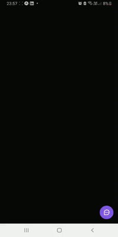
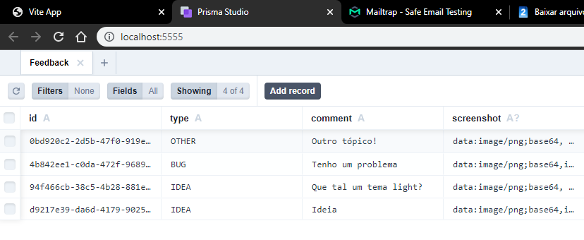

## Descrição
Aplicação desenvolvida de ponta a ponta (Front-end, Back-end e Mobile) durante uma semana intensiva da Rocketseat, abordando diversas tecnologias e ferramentas de mercado. Trata-se de uma pequena aplicação para cadastro no banco e envio de feedbacks pelos usuários por e-mail. Apesar de pequena em funcionalidades, aborda inúmeras tecnologias altamente utilizadas no mercado.

## 🚀 Tecnologias e ferramentas
- ReactJS
- React Native
- Nodejs
- JavaScript/TypeScript
- Jest
- Tailwind CSS
- SQLite
- Prisma
- Entre outras...

[Layout do Projeto](https://www.figma.com/community/file/1102912516166573468/Feedback-Widget)

## 💻 Web

## 📱 Mobile

### Dados registrados no banco

